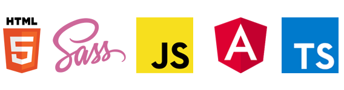

# Projeto Prático Front End

Este projeto foi gerado com as seguintes tecnologias.



Projeto prático do curso avançado de Angular ministrado pela instituição [Desenvolvedor.io](https://desenvolvedor.io/curso-online-desenvolvimento-avancado-em-angular)

O projeto consiste em realizar uma aplicação web para criar cruds de fornecedores e produtos, sendo que para isso é preciso realizar o login.

Foi trabalhado todo o processo de autenticação pelo lado do front aplicando estrategias de segurança e permissionamento de usuário. Também foi criado um módulo para cadastro de novos usuários.

As API's para consumo do front foram disponibilizadas e publicadas para consumo externo, segue link abaixo da documentação das API's.

- [Documentação API's](https://devio.fabrica.dev.br/swagger/index.html)

Estou aberto a sugestões e melhorias.

## Pré requisitos

- Instalar [NodeJS](https://nodejs.org/en/)
- Instalar [Angular](https://angular.io/guide/setup-local)
## Executando o projeto

### - Instalando as dependências

Após clonar o projeto é preciso instalar as dependências, o projeto final esta na branch 'main', use o seguinte comando para instalar as dependências:
```
npm i
```
### - Executando o front end
Para rodar a aplicação use o seguinte comando:
```
npm run start
```
Feito isso navegue para http://localhost:4200


Pronto, a aplicação vai estar rodando =)